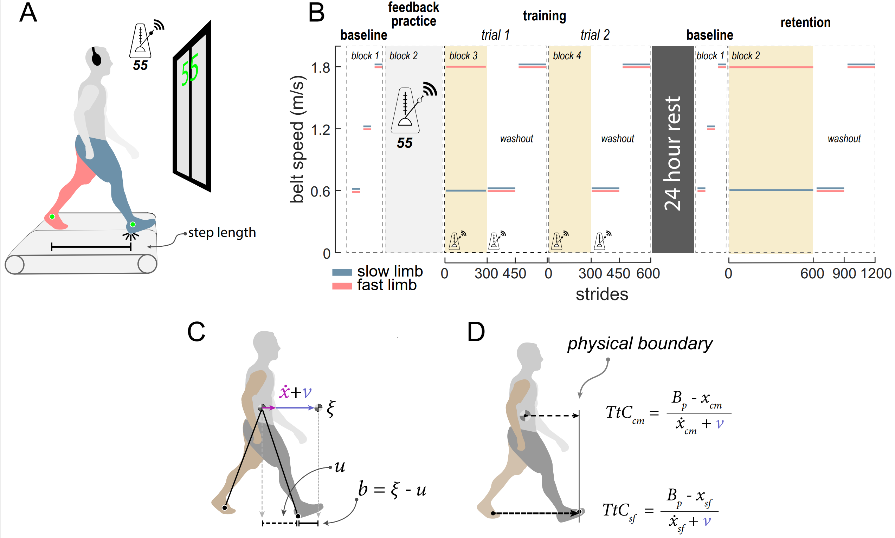

# Time-to-Contact_Gait
Calculation of the time-to-contact measure for the center of mass and trailing limb foot to the stance foot of a walker on a treadmill.

# Experimental Set up and Time-to-contact calculation

